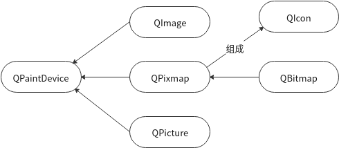

---

# Qt 图像数据相关类
&emsp;&emsp;Qt 提供了几个类用来处理图像数据：

@[TOC](Qt 图像数据相关类)

## 1. QImage
&emsp;&emsp;最常用的，对I/O操作进行优化。
* QPainter可以直接画上去
* 读取、保存、操作像素都用QImage
* 显示性能低于QPixmap
* 支持十几种图像格式（Format）
* 提供了一组函数，可以获取图片的各种信息、修改图片像素

> Qt的图像处理类只有`QImage`，其余几个仅仅是用于画图和显示。

## 2. QPixmap
&emsp;&emsp;针对显示做优化。
* QPainter可以直接画上去
* 读取没有`QImape`快，读取后内存占用比图片本身大小多好几倍
* 显示是Qt里最快的

> 大部分情况下使用`QImage`读取图片（小的无所谓，大图片必须用`QImage`），让后转成`QPixmap`用于显示。

## 3. QBitMap
&emsp;&emsp;`QPixmap`的子类，确保深度为1。

## 4. QIcon
&emsp;&emsp;一系列`QPixmap`。设置程序/按钮 图标时候使用，不同状态显示不同图片。

## 5. QPicuter
&emsp;&emsp;跟`QImage`一个父类`QPaintDevice`，`QPainter`可以直接画上去。类似绘画设备，有一些特别接口，比如`begin`和`end`可以实现绘画和重放。很少用