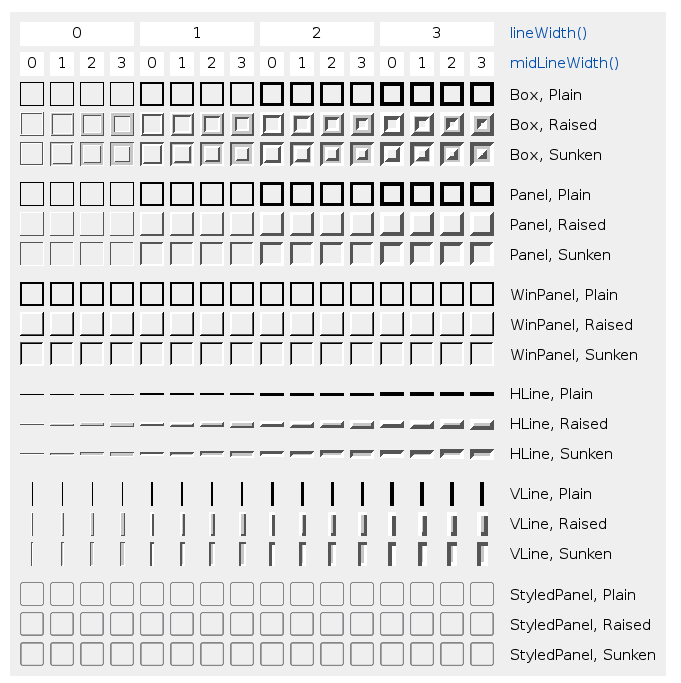
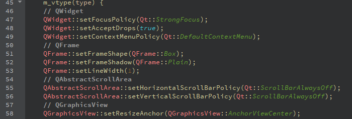
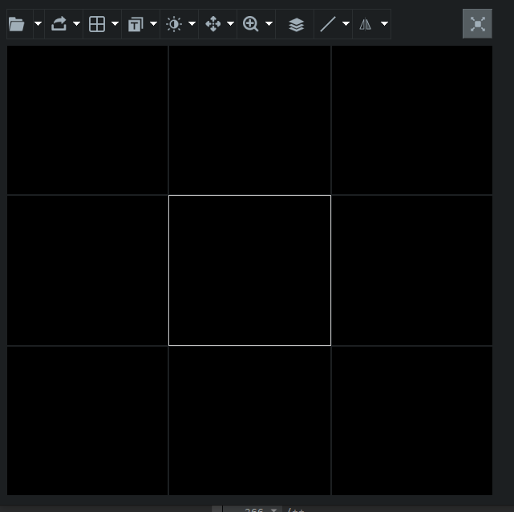

# Qt widget 增加边框
&emsp;&emsp;`Qt`自带很多控件，使用时经常需要给显示的窗口增加边框。实现方法也有很多：
* 样式表
* `QPaint`直接画
* `QFrame`


---
## 1. 样式表增加边框


---
## 2. QPaint增加边框


---
## 3. QFrame增加边框
&nbsp;&nbsp;`QFrame`是基本控件的基类，他继承自`QWidget`主要增加了边框的功能：  

[图片来自 doc.qt.ip](https://doc.qt.io/qt-5.15/qframe.html)  


```cpp
    enum Shape {
        NoFrame  = 0, // no frame
        Box = 0x0001, // rectangular box
        Panel = 0x0002, // rectangular panel
        WinPanel = 0x0003, // rectangular panel (Windows)
        HLine = 0x0004, // horizontal line
        VLine = 0x0005, // vertical line
        StyledPanel = 0x0006 // rectangular panel depending on the GUI style
    };
    Q_ENUM(Shape)
    enum Shadow {
        Plain = 0x0010, // plain line
        Raised = 0x0020, // raised shadow effect
        Sunken = 0x0030 // sunken shadow effect
    };
    Q_ENUM(Shadow)

    enum StyleMask {
        Shadow_Mask = 0x00f0, // mask for the shadow
        Shape_Mask = 0x000f // mask for the shape
    };

    Shape frameShape() const;
    void setFrameShape(Shape);
    Shadow frameShadow() const;
    void setFrameShadow(Shadow);

    int lineWidth() const;
    void setLineWidth(int);

    int midLineWidth() const;
    void setMidLineWidth(int);
```


&emsp;&emsp;`QFrame`的`lineWidth, midLineWidth, shadow, shape`属性组合构成的Qt基本控件的外框，上图展示了他们任意组合可以构成各种边框。自己搭配这几个属性不搞样式表或者`QPaint`也可实现想要的效果。比如：  
`Box+Plain+1`  




