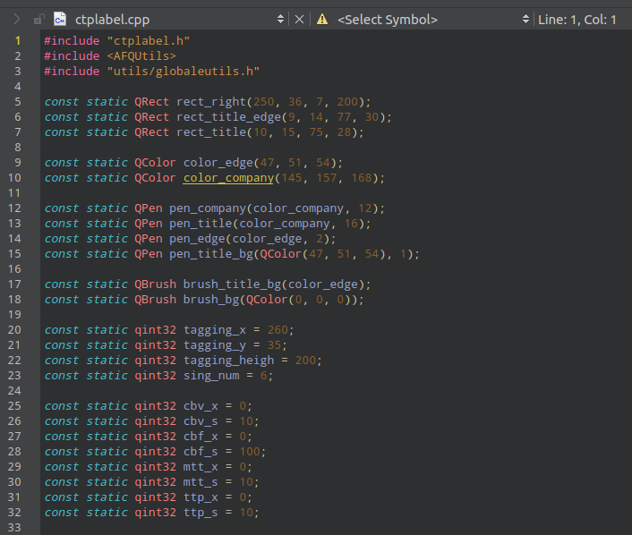
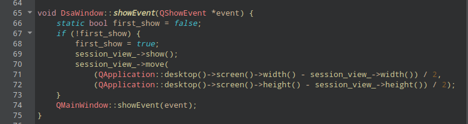

&emsp;&emsp;这个问题面试被问烂了，关于这个介绍很多了。看十遍不如自己写一遍

[原文链接](https://www.runoob.com/cplusplus/cpp-tutorial.html)

---

# c++ static 作用

### 1.1. 面向过程
* 全局变量和全局函数  
&emsp;&emsp;修饰前全局可见，修饰后只在当前文件可见。
> 同一个文件，用到相同的变量可以在开头声明下。

* 修饰局部变量  
&emsp;&emsp;这个值只第一次初始化，然后保留。以后每次再进入这个函数时候值依然留着。
> 可以作为一个标志，或者递增使用  

### 1.2. 面向对象 

* 修饰类的成员变量
&emsp;&emsp;这个类的所有对象共用这个成员变量。静态成员变量。
> 加锁、单例等，同一类不同实例需要共享数据时使用

* 修饰类的成员函数
&emsp;&emsp;这个成员函数不需要实例化就可以调用。这个函数也只能访问类内的静态成员变量。

> 写一些全局通用函数时用

---
&emsp;&emsp;`static`修饰的全局变量初始值默认为0。

