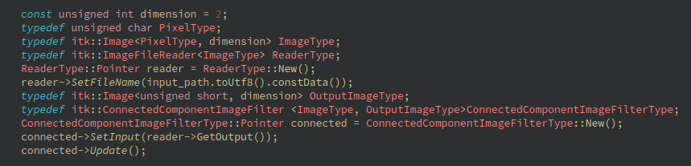
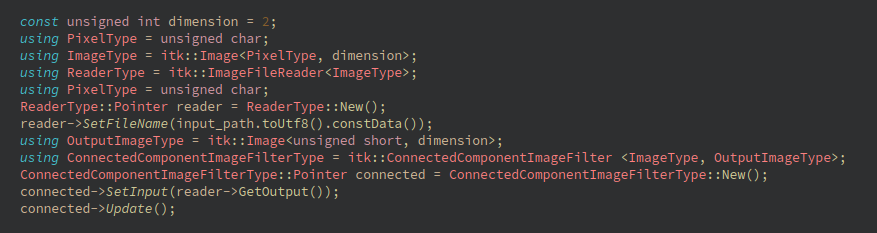

&ensp;&ensp;平时有用到itk（全是模板类和模板函数），使用起来又长又晦涩。一般都是给类取个别名。


---

# c++ 给类取别名
&ensp;&ensp;c++ 11 给类取别名的方式有两个`using`和`typedef`。


```cpp
template <typename T>
void Test(T a) {
    typedef typename T::list Self;
    using Self1 = typename T::list;
    Self b;
    Self1 c;
    std::cout << a << b << std::endl;
}

```

## using
&ensp;&ensp;c++中`using`关键字有两个作用：
- 声明命名空间
```cpp
     using namespace std;
```
- 给类型区别名
```cpp
     using 别名 = 原先类型；
```

## typedef

&ensp;&ensp;跟`using`用法一样，在C++11中，鼓励用`using`，而不用`typedef`。原因：







&ensp;&ensp;`using`的写法把别名和名称强制分离，中间用 = 号等起来，非常清晰。

## 函数指针

&ensp;&ensp;效果一样，效率一样。`using`看的更舒服

```cpp
typedef void (*Fp1)(const QString &str);
using Fp = void (*)(const QString &str);

void test1(const QString &str) {
    qDebug() << "test1" << str;
}
void test2(const QString &str) {
    qDebug() << "test2" << str;
}

int main() {
    Fp fp[2] = {test1, test2};
    fp[0]("hello");
    fp[1]("word");
    Fp1 fp1[2] = {test1, test2};
    fp1[0]("hello");
    fp1[1]("word");
    return 0;
}

```
结果
```
test1 "hello"
test2 "word"
test1 "hello"
test2 "word"
```

