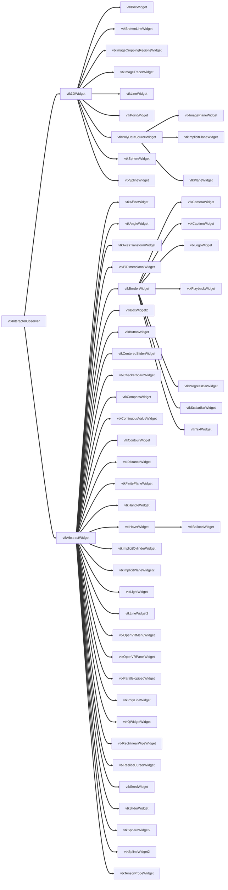

# Study-VTK：vtkWidget

@[TOC](Study-VTK：vtkWidget)
# vtk交互之　vtkWidget

## vtk交互介绍

&emsp;&emsp;我们在与图形/图像交互时，一般有两种方式：
&emsp;&emsp;&emsp;&emsp;&emsp;看的见的交互、和看不见的交互。

- **看不见的交互：**
&emsp;&emsp;手机浏览图片双手可以控制缩放、笔记本浏览网页时双手可以在触摸屏上实现鼠标滚动的操作、各种软件的快捷键都属于看不见的交互
- **看的见的交互：**
&emsp;&emsp;测量距离时选取第一个点后生成一条线、多个连通域选中其中一个连通域、图表的图例这些都属于看得见的交互

vtk在设计交互是按照这两个大类分开设计：
&emsp;&emsp;看不见的交互：交互样式（比如**KeyPressEvent**键盘响应事件）
&emsp;&emsp;看的见的交互：**vtk Widget**

&emsp;&emsp;vtk的看的交互都属于**vtkWidget**，大概可以分为（标注类、测量类、分割配准类、其他）。他们全部集成自两个类vtk3DWidget和vtkAbstractWidget。
&emsp;&emsp;&emsp;&emsp;**vtk3DWidget**：在三维渲染场景中生成可视化的实体。
&emsp;&emsp;&emsp;&emsp;**vtkAbstractWidget**：在三维渲染场景中生成 交互/表达 实体。
&emsp;&emsp;大致可以理解为**vtk3DWidget**下交互的对象是本身建立的，无法脱离交互而存在。**vtkAbstractWidget**仅仅是交互，起交互对象是完全脱离的数据。比如放置种子点**Widget** **vtkSeedWidget**。就是继承自**vtkAbstractWidget**，他的种子点就是独立出去的单独数据，其他**widget**也可以操作。
&emsp;&emsp;**vtkAbstractWidget**好处就是事件的处理与**widget**的表达互不干扰，同一个**widget**可以使用不同的表达。

# vtkWidget继承关系图

# vtkWidget 详细使用

&emsp;&emsp;每个vtkWidget（vtk3DWidget下的几个除外），都会把vtk事件改成widget事件。说白了就是所有的看的见的交互事件都是把看不见的交互绑定过来，如果我们对看的见的交互不满意，可以直接换，使用vtkWidgetEventTranslator。（如果是Qt的话有一套信号槽绑定方式。InvokeEvent vtkEventQtSlotConnect vtkCommand）
## 创建Widget
&emsp;&emsp;每个widget都提供了不同的功能以及不同的API，但是widget的创建以及使用基本一样。
    1）实例化widget
    2）指定渲染窗口交互器
    3）创建回调函数（qt里就直接绑定信号和槽）
    4）创建模型，并与widget关联
    5）激活widget
    6）反激活widget

接下来周末空余时候了解常用widget的使用方法，并整理记录：

## 1. 测量类Widget

| Widget类名 | 缩略图 | 说明 | 详细使用方法 |
|-|-|-|-|
| [vtkDistanceWidget](https://vtk.org/doc/nightly/html/classvtkDistanceWidget.html)  |    |  用来在二位平面上测量点与点的距离 |
| [vtkAngleWidget](https://vtk.org/doc/nightly/html/classvtkAngleWidget.html)   |   |  用来在二位平面上测量角度  |
| [vtkBiDimensionalWidget](https://vtk.org/doc/nightly/html/classvtkBiDimensionalWidget.html)   |   |  用来在二位平面上测量两个正交方向的轴长  |

#### &emsp;&emsp;2. 标注类Widget

| Widget类名 | 缩略图 | 说明 | 详细使用方法 |
|-|-|-|-|
| [vtkBoxWidget](https://vtk.org/doc/nightly/html/classvtkBoxWidget.html)|    |  显示文本 |[vtkWidget 标注类Widget之 文本显示vtkTextWidget](https://blog.csdn.net/a15005784320/article/details/105027338) 
| [vtkScalarBarWidget](https://vtk.org/doc/nightly/html/classvtkScalarBarWidget.html)  |    |  显示标量条 |
| [vtkCaptionWidget](https://vtk.org/doc/nightly/html/classvtkCaptionWidget.html)  |    |  带箭头的文本 |
| [vtkOrientationMarkerWidget](https://vtk.org/doc/nightly/html/classvtkOrientationMarkerWidget.html)  |    |  方向指示标志 |
| [vtkBalloonWidget](https://vtk.org/doc/nightly/html/classvtkBalloonWidget.html)  |    |  鼠标悬停提示信息 |
| [vtkBorderWidget](https://vtk.org/doc/nightly/html/classvtkBorderWidget.html)  |    |  在2D矩形区域周围放置边框 |[vtkWidget 标注类Widget之 在2D矩形区域周围放置边框](https://blog.csdn.net/a15005784320/article/details/105027710)

#### &emsp;&emsp;3. 分割/配准类Widget

| Widget类名 | 缩略图 | 说明 | 详细使用方法 |
|-|-|-|-|
| [vtkSeedWidget](https://vtk.org/doc/nightly/html/classvtkSeedWidget.html)| |用于在场景中放置多个种子点|[vtkWidget 分割/配准类之 放置种子点](https://blog.csdn.net/a15005784320/article/details/104859208)
| [vtkBrokenLineWidget](https://vtk.org/doc/nightly/html/classvtkBrokenLineWidget.html)  |    |  用于操纵折线的Widget |[Study-VTK：vtkWidget 分割/配准类之 操纵折线 vtkBrokenLineWidget](https://blog.csdn.net/a15005784320/article/details/105214176)
| [vtkContourWidget](https://vtk.org/doc/nightly/html/classvtkContourWidget.html)  |    |  绘制轮廓线 |
| [vtkImageTracerWidget](https://vtk.org/doc/nightly/html/classvtkImageTracerWidget.html)  |    |  绘制轨迹线 |
| [vtkCheckerboardWidget](https://vtk.org/doc/nightly/html/classvtkCheckerboardWidget.html)  |    |  二维图像添加网格 |
| [vtkRectilinearWipeWidget](https://vtk.org/doc/nightly/html/classvtkRectilinearWipeWidget.html)  |    |  二维图像添加网格 |

## 4. 其他Widget

| Widget类名 | 缩略图 | 说明 | 详细使用方法 |
|-|-|-|-|
| [vtkBoxWidget](https://vtk.org/doc/nightly/html/classvtkSeedWidget.html)| |定义了一个ROI该区域由任意方向的六面体表示|[vtkWidget 分割/配准类之 正交六面体3D小部件 vtkBoxWidget](https://blog.csdn.net/a15005784320/article/details/105191196)

## 5. 待分类学习

| Widget类名 | 
|-|
| vtkImageCroppingRegionsWidget
| vtkLineWidget
| vtkPointWidget
| vtkPolyDataSourceWidget
| vtkImagePlaneWidget
| vtkImplicitPlaneWidget
| vtkPlaneWidget
| vtkSphereWidget
| vtkSplineWidget
| vtkAbstractWidget
| vtkAffineWidget
| vtkAxesTransformWidget
| vtkCameraWidget
| vtkLogoWidget
| vtkPlaybackWidget
| vtkProgressBarWidget
| vtkBoxWidget2
| vtkButtonWidget
| vtkCenteredSliderWidget
| vtkCompassWidget
| vtkContinuousValueWidget
| vtkFinitePlaneWidget
| vtkHandleWidget
| vtkHoverWidget
| vtkImplicitCylinderWidget
| vtkImplicitPlaneWidget2
| vtkLightWidget
| vtkLineWidget2
| vtkOpenVRMenuWidget
| vtkOpenVRPanelWidget
| vtkParallelopipedWidget
| vtkPolyLineWidget
| vtkQWidgetWidget
| vtkResliceCursorWidget
| vtkSliderWidget
| vtkSphereWidget2
| vtkSplineWidget2
| vtkTensorProbeWidget
