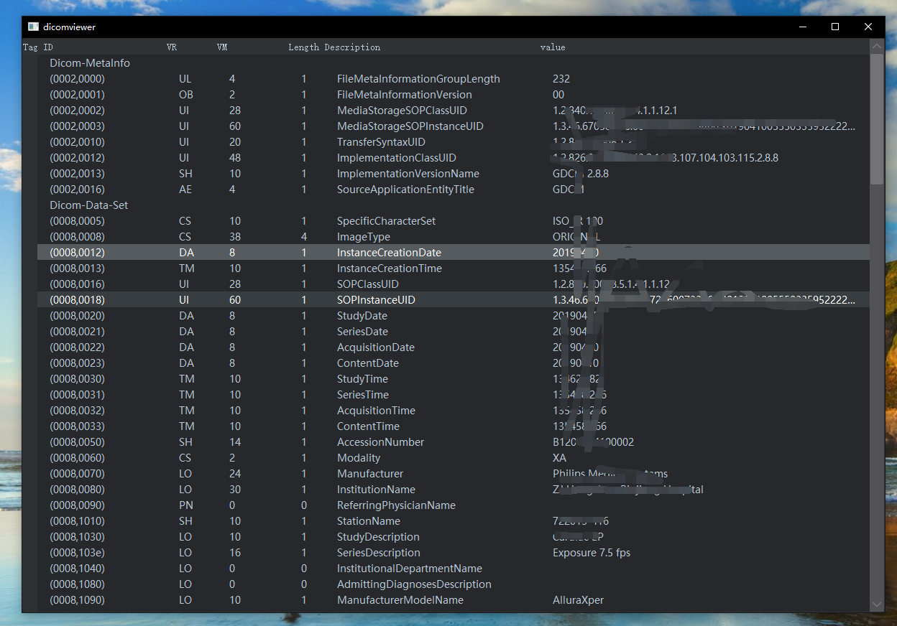
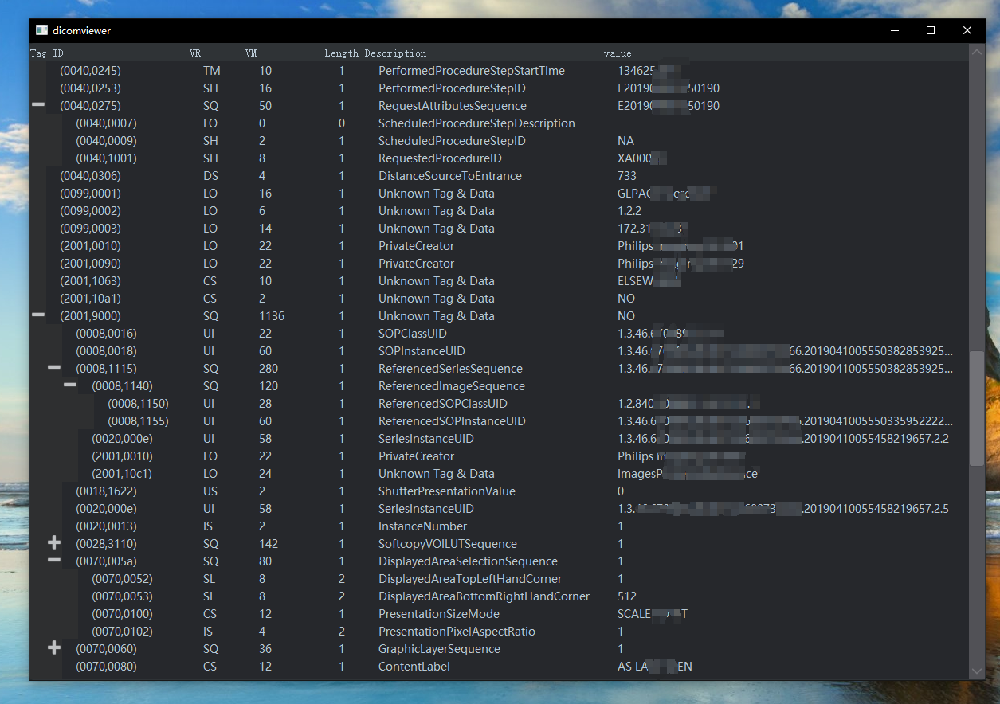
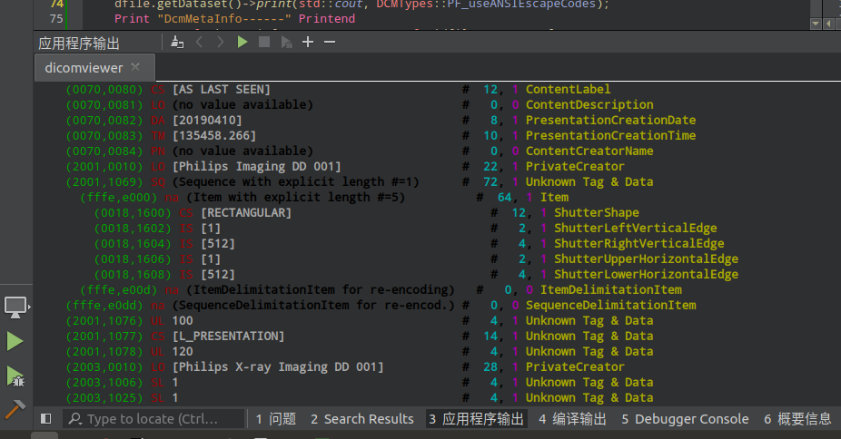
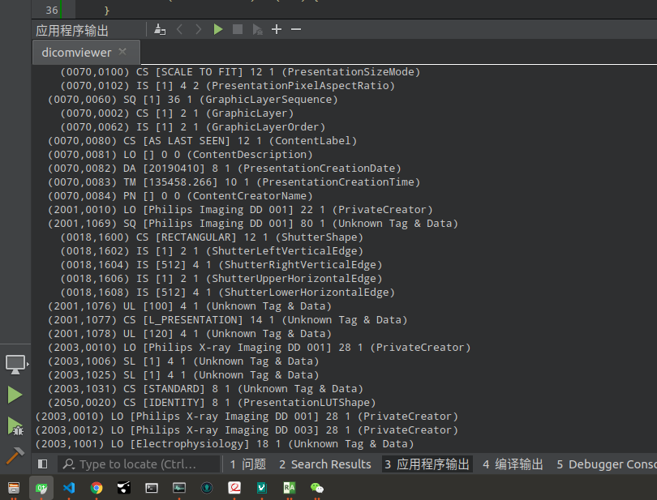

&emsp;&emsp;做**kissDicomViewer**需要用到遍历标签功能。记录下每天学习内容

项目地址：
[CodeChina kissDicomViewer](https://codechina.csdn.net/a15005784320/kiss-dicom-viewer)  
详细介绍：
[CSDN 一个简单的 DICOM 浏览器](https://beondxin.blog.csdn.net/article/details/108678403)  

---
# DCMTK 遍历 DICOM 标签/Tags  并 可视化

## 1. 效果

&emsp;&emsp;请无视目前样式，这个只是自己做遍历标签可视化测试用的。后续会抄小蚂蚁加上搜索、右键拷贝值、拷贝全部值、拷贝键等等。

&emsp;&emsp;区分`MetaInfo`和`DataSet`  
  


&emsp;&emsp;四层嵌套显示效果  
  



---

## 2. 现成接口，转成其他格式后再解析

&emsp;&emsp;做`DICOM`浏览器时有一个需求是显示所有`DCIOM`标签。找了下`dcmtk`的相关资料，竟然没有输出所有`DCIOM`标签的案例。`DCIOM`提供了三个默认的接口用来可视化`DCIOM`标签。

* 直接在控制台或者`ostream` 输出标签  
* 转成`JSON`  --可以看**app**里 **dcm2json**  
* 转成`XML`  --可以看**app**里 **dcm2xml**  

```cpp
virtual void print(STD_NAMESPACE ostream &out,
                    const size_t flags = 0,
                    const int level = 0,
                    const char *pixelFileName = NULL,
                    size_t *pixelCounter = NULL) = 0;

virtual OFCondition writeJson(STD_NAMESPACE ostream &out,
                              DcmJsonFormat &format);

virtual OFCondition writeXML(STD_NAMESPACE ostream &out,
                              const size_t flags = 0);

```

&emsp;&emsp;一开始打算转成`XML`/`JSON`，然后用QT做一个`XML`/`JSON`解析器再可视化到窗口。也能实现就是感觉太麻烦了。

---

## 3. 利用DcmItem::nextInContainer 实现遍历
&emsp;&emsp;这块中文资料还是太少了，没有一个现成的直接遍历标签的办法。找到两篇中文博客说：用`DcmItem::nextInContainer`来实现，看`doxygen`介绍应该是默认用的办法，就是没找到现成案例
[https://blog.csdn.net/qq_39071305/article/details/102474753](https://blog.csdn.net/qq_39071305/article/details/102474753)
[https://blog.csdn.net/a36254094/article/details/7614428](https://blog.csdn.net/a36254094/article/details/7614428)
&emsp;&emsp;我没去试，这两篇博客作者指出这个办法`SQ`数据不能很好的读取。
> 看到好几个博客说`SQ`只能嵌套三层，我手上测试用的影响就是嵌套四层的。`DICOM`协议我找了一下**part05 第七章**也没看到有说最多嵌套几层。不知道是当时作者翻译错了还是我没找到。有知道望给个说明。

---

## 4. 直接拿DcmList遍历
&emsp;&emsp;现成的实在没找到，看下源码吧。`DCMTK`就是把数据集搞了一个双链表类：`DcmList`。看了下源码后自己的理解：[DCMTK 关于DICOM数据集的处理]()。那我直接获取这个`DcmList`，然后遍历吧。

> 想了个 2B 的办法，够简单就是不优雅、`DCMTK`开发人员看到估计很鄙视这种办法。


&emsp;&emsp;下边段代码都是实现遍历输出，如果你只是输出的话，`DCMTK`有现成的（开头三种办法）

* 使用默认接口的办法和输出结果  
```cpp
dfile.getMetaInfo()->print(std::cout,DCMTypes::PF_useANSIEscapeCodes);
dfile.getDataset()->print(std::cout,DCMTypes::PF_useANSIEscapeCodes);
```
  


* 获取`DcmList`自己遍历的办法和输出结果  
  

```cpp
#include "dcmtk/dcmdata/dctk.h"

#define Print std::cout<<
#define Printend <<std::endl;
#define PrintemspValue(emsp,value1,value2,value3,value4,value5,value6) \
    for(int i = 0; i < emsp; i++) {Print "\40\40";}\
    Print value1 <<" "  <<value2<<" ["<< value3 <<"] "\
                 << value4 <<" " <<value5 <<" (" <<value6<<")" Printend

template<typename T>
class NewDcmItem: public T {
  public:
    NewDcmItem(const T &old): T(old) {
    }
    DcmList *GetDcmList()const {
        return this->elementList;
    }
  protected:
    virtual ~NewDcmItem() {}
};
using MyDcmDataset = NewDcmItem<DcmDataset>;
using MyDcmMetaInfo = NewDcmItem<DcmMetaInfo>;
using MywDcmItem = NewDcmItem<DcmItem>;

template<typename T>
void PaintTags(T &t, const int &emsp = 0) {
    DcmList *elementList = t.GetDcmList();
    if (!elementList->empty()) {
        DcmObject *dO;
        DcmTag tag;
        OFString value;
        elementList->seek(ELP_first);
        do {
            dO = elementList->get();
            tag = dO->getTag();
            DcmElement *elem;
            t.findAndGetElement(tag, elem);
            elem->getOFString(value, 0);
            PrintemspValue(emsp, tag, tag.getVRName(),
                           value, dO->getLength(), dO->getVM(), tag.getTagName())
            if(EVR_SQ == dO->getVR()) {
                DcmItem *sq;
                t.findAndGetSequenceItem(dO->getTag(), sq);
                MywDcmItem *dcmitem_info = new MywDcmItem(*sq);
                PaintTags(*dcmitem_info, emsp + 1);
            }
        } while (elementList->seek(ELP_next));
        delete dO;
    }
}

int main() {
    DcmFileFormat dfile;
    dfile.loadFile("/home/arteryflow/图片/DicomData/DSA/Liyunlong/IMG-0002-00001.dcm");
    Print "DcmMetaInfo------" Printend
    MyDcmMetaInfo *meta_info = new MyDcmMetaInfo(*dfile.getMetaInfo());
    PaintTags(*meta_info);
    Print "DcmDataset------" Printend
    MyDcmDataset *dataset_info = new MyDcmDataset(*dfile.getDataset());
    PaintTags(*dataset_info);
}

```

  



## 5. 结合Qt可视化


&emsp;&emsp;最开始结果图的程序，仅仅可视化。小蚂蚁这块的功能等过年在搞。

```cpp
#include "dcmtk/dcmdata/dctk.h"

template<typename T>
class NewDcmItem: public T {
  public:
    NewDcmItem(const T &old): T(old) {
    }
    DcmList *GetDcmList()const {
        return this->elementList;
    }
  protected:
    virtual ~NewDcmItem() {}
};
using MyDcmDataset = NewDcmItem<DcmDataset>;
using MyDcmMetaInfo = NewDcmItem<DcmMetaInfo>;
using MywDcmItem = NewDcmItem<DcmItem>;

//
template<typename T>
void GenerateItems(QList<QTreeWidgetItem *> &items, T &t) {
    DcmList *elementList = t.GetDcmList();
    if (!elementList->empty()) {
        DcmObject *dO;
        DcmTag tag;
        OFString value;
        elementList->seek(ELP_first);
        do {
            dO = elementList->get();
            tag = dO->getTag();
            DcmElement *elem;
            t.findAndGetElement(tag, elem);
            elem->getOFString(value, 0);
            QTreeWidgetItem *tmp_item = new QTreeWidgetItem;
            tmp_item->setText(0, QString::fromLocal8Bit(tag.toString().c_str()));
            tmp_item->setText(1, tag.getVRName());
            tmp_item->setText(2, QString::number(dO->getLength()));
            tmp_item->setText(3, QString::number(dO->getVM()));
            tmp_item->setText(4, tag.getTagName());
            tmp_item->setText(5, QString::fromLocal8Bit(value.c_str()));
            if(EVR_SQ == dO->getVR()) {
                QList<QTreeWidgetItem *> tmp_items;
                DcmItem *sq;
                t.findAndGetSequenceItem(dO->getTag(), sq);
                MywDcmItem *dcmitem_info = new MywDcmItem(*sq);
                GenerateItems(tmp_items, *dcmitem_info);
                tmp_item->addChildren(tmp_items);
            }
            items << tmp_item;
        } while (elementList->seek(ELP_next));
        delete dO;
    }
}

QTreeWidget *GetWid() {
    QTreeWidget *wid = new QTreeWidget;
    wid->setHeaderLabels(QStringList()
                         << "Tag ID" << "VR" << "VM" << "Length" << "Description" << "value");
    wid->setColumnWidth(0, 200);
    wid->setColumnWidth(1, 70);
    wid->setColumnWidth(2, 100);
    wid->setColumnWidth(3, 50);
    wid->setColumnWidth(4, 300);
    wid->setColumnWidth(5, 300);
    wid->setGeometry(0, 0, 1200, 800);
    return wid;
}

int main(int argc, char *argv[]) {
    QApplication a(argc, argv);
    using namespace Kiss;
    QUIHelper::SetStyle(":/Style/style.qss");
    // 初始化 TreeWidget
    QTreeWidget *wid = GetWid();
    QList<QTreeWidgetItem *> items;
    // 读取文件
    DcmFileFormat dfile;
    dfile.loadFile("C:/Users/77935/Pictures/dcm/source.dcm");
    //
    QTreeWidgetItem *metainfo_item = new QTreeWidgetItem;
    metainfo_item->setText(0, "Dicom-MetaInfo");
    items << metainfo_item;
    MyDcmMetaInfo *meta_info = new MyDcmMetaInfo(*dfile.getMetaInfo());
    GenerateItems(items, *meta_info);
    QTreeWidgetItem *dataset_item = new QTreeWidgetItem;
    dataset_item->setText(0, "Dicom-Data-Set");
    items << dataset_item;
    MyDcmDataset *dataset_info = new MyDcmDataset(*dfile.getDataset());
    GenerateItems(items, *dataset_info);
    // 显示
    wid->addTopLevelItems(items);
    wid->show();
    return a.exec();
}

```