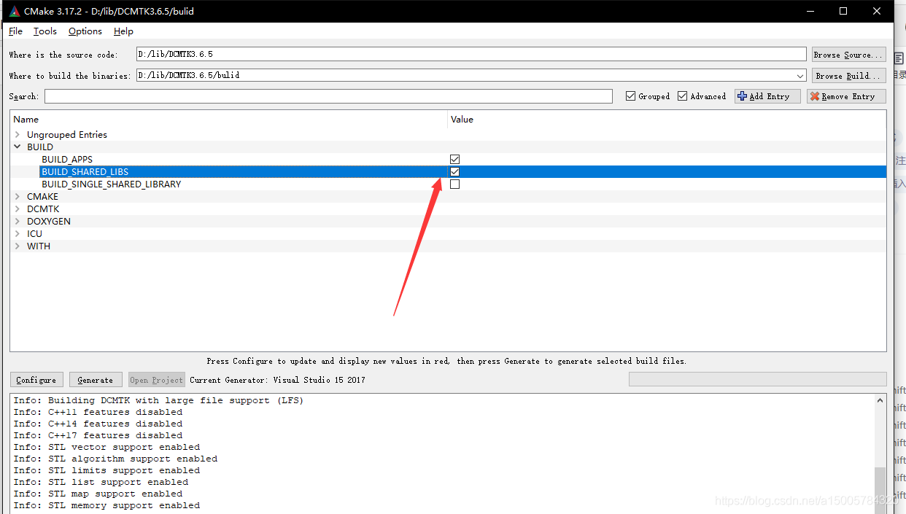

# DCMTK   检测到“RuntimeLibrary”的不匹配项: 值“MT_StaticRelease”不匹配值“MD_DynamicRelease”


* `DCMTK`链接时报错：

```cpp
ofstd.lib(ofcond.obj):-1: error: LNK2038: 检测到“RuntimeLibrary”的不匹配项:
 值“MT_StaticRelease”不匹配值“MD_DynamicRelease”(mocs_compilation.cpp.obj 中)
```
* 解决办法：  

&emsp;&emsp;没有生成动态链接库，重新编译下就可以




