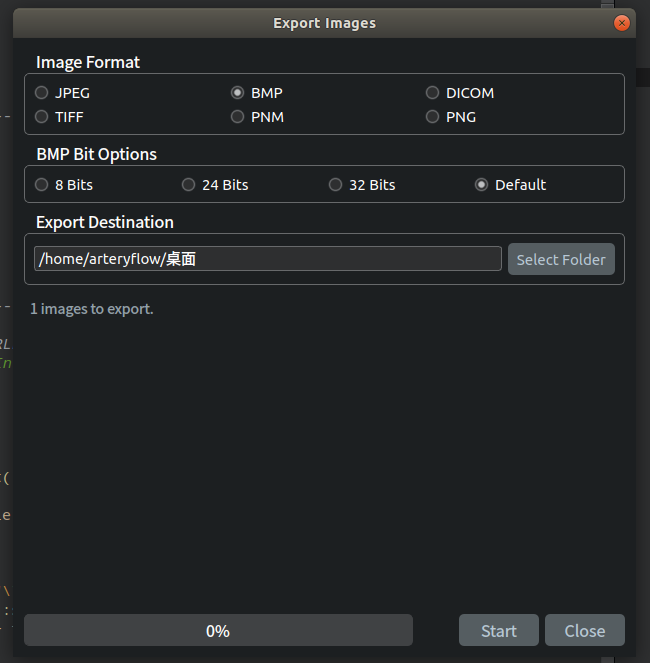

# 利用DCMTK实现dcm文件转图片 jpeg bmp dicom tiff pnm png  

项目地址：
[CodeChina kissDicomViewer](https://codechina.csdn.net/a15005784320/kiss-dicom-viewer)  
详细介绍：
[CSDN 一个简单的 DICOM 浏览器](https://beondxin.blog.csdn.net/article/details/108678403)  

---

## 实现功能
&emsp;&emsp;`DICOM`浏览器自然少不了当前打开文件转成图片的功能，可以导出当前选择层和全部层。根据当前打开的不同文件和选项输出单张图片或者序列图片。 本来想增加导出**mp4**的功能，可惜`DCMTK`没有现成的，需要引入`ffmpeg`。想了想还是等常规功能做完了以插件形式引入吧。

>  需要注意文件输入：单张单层、单张多层（z表示时间）、多张单层（z表示时间）、多张多层（z表示高度）、多张多层（两个z轴分别表示：高度和时间）


## 导出办法
&emsp;&emsp;利用`DCMTK`的现成接口即可实现图片的导出：
* `DicomImage::writeRawPPM` ： **DICOM**文件  ==>  **PPM**图片
* `DicomImage::writeBMP` ： **DICOM**文件  ==>  **BMP**图片
* `DicomImage::writePluginFormat` + `DiJPEGPlugin` ： **DICOM**文件  ==>  **JPEG**图片
* `DicomImage::writePluginFormat` + `DiPNGPlugin` ： **DICOM**文件  ==>  **PNG**图片
* `DicomImage::writePluginFormat` + `DiTIFFPlugin` ： **DICOM**文件  ==>  **TIFF**图片

>   `TIFF`文件需要提前安装`libtiff`，并且`DCMTK`编译时加上**tiff**选项。
>   `PNG`文件需要提前安装`libpngic`，并且`DCMTK`编译时加上**PNG**选项。


|      变量      |        说明        |
| :-----------: | :---------------: |
|    abort_     |    终止当前转换     |
|   leaflet_    |    导出单张/多张    |
| jpeg_quality_ |    jpeg 压缩质量    |
|    frame_     |   导出单张时第几层   |
|  file_type_   |      导出类型       |
|   dest_dir_   |      导出目录       |
| image_files_  | 输入文件(单个或序列) |


```cpp
void ExportImageThread::run() {
    DcmRLEDecoderRegistration::registerCodecs(); // 寄存器RLE解压编解码器
    DJDecoderRegistration::registerCodecs(EDC_photometricInterpretation); // 注册JPEG解压缩编解码器
    foreach (QString file, image_files_) {
        if (abort_) {
            break;
        }
        DcmFileFormat dfile;
        OFCondition cond = dfile.loadFile(file.toLocal8Bit().data());
        if (cond.bad()) {
            emit resultReady(tr("Failed: %1, %2.").arg(file, cond.text()));
            continue;
        }
        QString fileName = file;
        fileName.replace("/", QDir::separator()).replace("\\", QDir::separator());
        fileName = fileName.mid(fileName.lastIndexOf(QDir::separator()) + 1);
        QString filepath = dest_dir_ + QDir::separator() + fileName;
        QDir().mkpath(dest_dir_);
        if (file_type_ == EFT_Dicom) {
            OFCondition l_error = dfile.saveFile(filepath.toLocal8Bit().data());
            if (EC_Normal == l_error) {
                emit resultReady(tr("Exported: %1.").arg(file));
            } else {
                emit resultReady(tr("Failed: %1, %2.").arg(file, l_error.text()));
            }
            continue;
        }
        DcmDataset *dataset = dfile.getDataset();
        E_TransferSyntax xfer = dataset->getOriginalXfer();
        Sint32 frameCount;
        if (dataset->findAndGetSint32(DCM_NumberOfFrames, frameCount).bad()) {
            frameCount = 1;
        }
        ulong compabilityMode = CIF_DecompressCompletePixelData;
        if (frameCount > 1) {
            compabilityMode |= CIF_UsePartialAccessToPixelData;
        }
        DicomImage *di = new DicomImage(&dfile, xfer, compabilityMode);
        if (di->getStatus() != EIS_Normal) {
            emit resultReady(tr("Failed: %1, %2.").arg(file,
                             QString::fromLocal8Bit(DicomImage::getString(di->getStatus()))));
            delete di;
            continue;
        }
        di->setWindow(0);
        /* 将所选帧写入文件 */
        FILE *ofile = nullptr;
        QString suffix = GetSuffix(di);
        int result = 0;
        qint32 generate = this->frame_;
        qint32 generate_end = this->leaflet_ ? this->frame_ + 1 : frameCount;
        if(generate < frameCount) {
            for (; generate < generate_end; generate++) {
                /* 输出到文件 */
                if (fileName.right(4) == QString(".dcm")) {
                    fileName = fileName.mid(0, file.lastIndexOf('.'));
                }
                QString filepath = dest_dir_ +
                                   QDir::separator() +
                                   QString("%1%2%3.%4").arg(
                                       fileName,
                                       frameCount > 1 ? QString::number(generate) : QString(),
                                       this->leaflet_ ? "(" + QString::number(generate) + ")" : "",
                                       suffix);
                ofile = fopen(filepath.toLocal8Bit().data(), "wb");
                if (ofile == nullptr) {
                    emit resultReady(tr("Failed: %1, open dest file failed.").arg(file));
                    continue;
                }
                switch (file_type_) {// 最后创建输出图像文件
                    case EFT_RawPNM:
                        result = di->writeRawPPM(ofile, 8, static_cast<quint32>(generate));
                        break;
                    case EFT_8bitPNM:
                        result = di->writePPM(ofile, 8, static_cast<quint32>(generate));
                        break;
                    case EFT_16bitPNM:
                        result = di->writePPM(ofile, 16, static_cast<quint32>(generate));
                        break;
                    case EFT_BMP:
                        result = di->writeBMP(ofile, 0, static_cast<quint32>(generate));
                        break;
                    case EFT_8bitBMP:
                        result = di->writeBMP(ofile, 8, static_cast<quint32>(generate));
                        break;
                    case EFT_24bitBMP:
                        result = di->writeBMP(ofile, 24, static_cast<quint32>(generate));
                        break;
                    case EFT_32bitBMP:
                        result = di->writeBMP(ofile, 32, static_cast<quint32>(generate));
                        break;
                    case EFT_JPEG: {/* 初始化JPEG插件 */
                            DiJPEGPlugin plugin;
                            plugin.setQuality(static_cast<quint32>(jpeg_quality_));
                            plugin.setSampling(ESS_422);
                            result = di->writePluginFormat(&plugin, ofile, static_cast<quint32>(generate));
                        }
                        break;
#ifdef WITH_LIBPNG
                    case EFT_PNG: { /* 初始化PNG插件 */
                            DiPNGPlugin pngPlugin;
                            pngPlugin.setInterlaceType(E_pngInterlaceAdam7);
                            pngPlugin.setMetainfoType(E_pngFileMetainfo);
                            result = di->writePluginFormat(&pngPlugin, ofile, static_cast<quint32>(generate));
                        }
                        break;
#endif
                    case EFT_PastelPNM:
                        result = di->writePPM(ofile, MI_PastelColor, static_cast<quint32>(generate));
                        break;
#ifdef WITH_LIBTIFF
                    case EFT_TIFF: {
                            /* initialize TIFF plugin */
                            DiTIFFPlugin tiffPlugin;
                            tiffPlugin.setCompressionType(E_tiffPackBitsCompression);
                            tiffPlugin.setLZWPredictor(E_tiffLZWPredictorDefault);
                            tiffPlugin.setRowsPerStrip(OFstatic_cast(unsigned long, 0));
                            result = di->writePluginFormat(&tiffPlugin, ofile, static_cast<quint32>(frame));
                        }
#endif
                    default:
                        break;
                }
                if (result) {
                    emit resultReady(tr("Exported: %1.").arg(file));
                } else {
                    emit resultReady(tr("Failed: %1, conversion failed.").arg(file));
                }
                fclose(ofile);
            }
        }
        delete di;
    }
    DcmRLEDecoderRegistration::cleanup(); // 注销RLE解压缩编解码器
    DJDecoderRegistration::cleanup(); // 注销JPEG解压缩编解码器
}
```


## 界面




