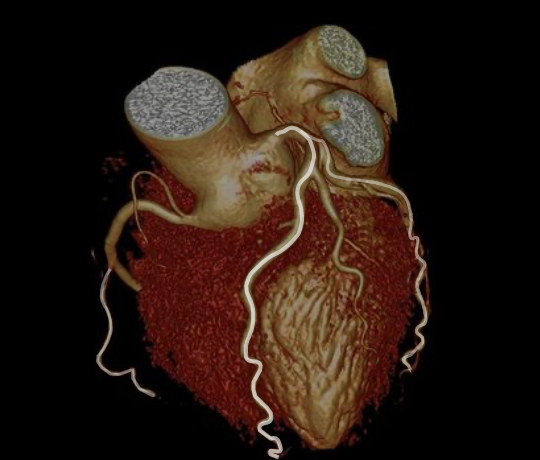
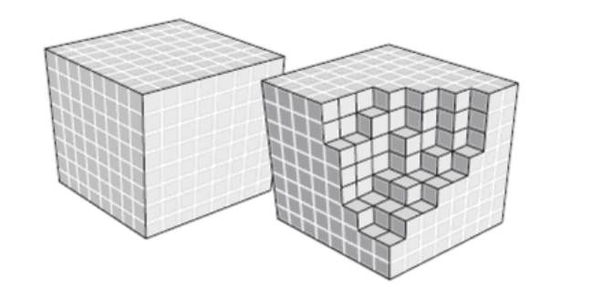

&emsp;&emsp;最近让做体渲染，之前公司没人做过，自己研究吧。给的UI这样：

主要参考：
* [GPU编程与CG语言之阳春白雪下里巴人](https://zhuanlan.zhihu.com/p/84268704) 14章-15章 
* [VTK图形图像开发进阶](https://blog.csdn.net/www_doling_net)  7章
* [VTKUsersGuide](https://vtk.org/vtk-users-guide/)
* [VTKTextbook](https://vtk.org/vtk-textbook/)

&emsp;&emsp;我只是走马观花的看了下，能满足要求就行，记录下自己需要的。如果你也需要实现体渲染功能，强烈建议看下原文。这几个pdf百度可以直接搜到下载，我整理了下：
- **GPU编程与CG语言之阳春白雪下里巴人** 
共享地址:http://118.25.63.144:505/index.php?share/file&user=1&sid=azUARmB9  提取密码:AMOFp
- **VTK-File-Format**
 共享地址:http://118.25.63.144:505/index.php?share/file&user=1&sid=HUEeJT7V  提取密码:w00kt
- **VTKTextbook** 
共享地址:http://118.25.63.144:505/index.php?share/file&user=1&sid=3SfZcEmX  提取密码:jcf2m
- **VTKUsersGuide** 
共享地址:http://118.25.63.144:505/index.php?share/file&user=1&sid=7jPTshri  提取密码:nwzX0
- **VTK图形图像开发进阶** 
共享地址:http://118.25.63.144:505/index.php?share/file&user=1&sid=jZSKJfhb  提取密码:D0b5p

---

&emsp;&emsp;正文：

# Study-VTK VTk(8.x、9.x) 体渲染学习

## 体绘制概念

体绘制描述了一系列的“根据三维标量数据产生二维图片”的技术。
体绘制核心在于展示体细节。体绘制技术可以在一幅图像中显示多种物质的综合分布情况，并且根据不透明度的控制，反应等值面的情况。

举例：相机和ct机拍的照片都是二维的，但是展现信息不同。

## 体绘制可视化

&emsp;&emsp;体绘制目标是在一幅图片上展示空间体细节。比如：
- 站在房子外只能看到房子的轮廓（普通图片）；
- 如果房子的轮廓是透明的，就可以看到房子内部的具体信息（体绘制）。

## 体绘制应用

&emsp;&emsp;主要是医学领域，此外还有地质勘探、气象分析、分子模型构等。
&emsp;&emsp;体绘制技术也能用于强化视觉效果。

## 体绘制与光照模型
&emsp;&emsp;体绘制跟光照模型很相似。

* 透明光照模型  
一般跟踪光线的交互过程，并在一系列交互中计算颜色值。

* 体渲染技术  
在同一射线方向上对体数据进行采样，获取每个体素的颜色值，根据其透明度进行合成。

## 体数据

&emsp;&emsp;体数据与面数据：实心铅球跟空心乒乓球。体数据和面数据本质区别在于是否包含了体细节，跟维度无关。
### 体素
&emsp;&emsp;体素是组成数据的最小单元。

### 纹理

1. 三维纹理和体纹理是一个概念，三维纹理和二维纹理不是一个概念。
2. 三维纹理通过三维纹理坐标进行访问。

### 体绘制算法
1. 光线投射算法

&emsp;&emsp;

剩下三个还没研究过：

2. 错切-变形算法
3. 频域体算法
4. 抛雪球算法

OSPRay  Intel开发的一个开源、可扩展的光线追踪引擎

