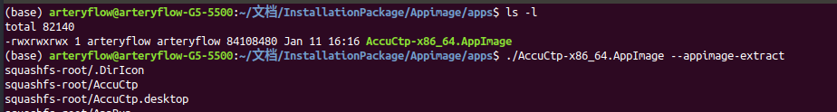
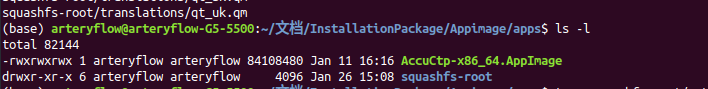
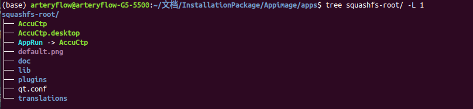
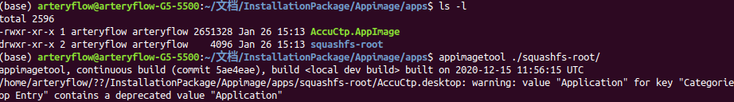

# Linux 下Appimage 压缩解压命令


参考  [https://github.com/AppImage/AppImageKit](https://github.com/AppImage/AppImageKit)


## 1. 需求  

公司有几款产品打包成`appimage`的形式，现场测试时有时需要替换其中几个库（比如加密狗、图片等），就需要解压文件然后在压缩。本来认为需要每次打包后无法修改。翻了下官方介绍才发现，`appimage`支持直接压缩和解压。

## 2. 打包好的 Appimage 解压

> `--appimage-extract` extracts the contents from the embedded filesystem image, then exits. This is useful if you are using an AppImage on a system on which FUSE is not available

> `--appimage extract`    从嵌入的文件系统映像中提取内容，然后退出。如果您在FUSE不可用的系统上使用AppImage，这将非常有用








## 3. 打包好的 Appimage 解压修改后在压缩

`linuxdeployqt`  可以用来给可执行程序复制引用库、制作**AppRun**、快捷方式并压缩。

> `appimagetool` 则可以直接压缩  “已经打包好的`appimage`解压后的文件夹（上一步解压的文件夹）”。

请注意使用`appimagetool`压缩时，只检验文件夹内是否存在快捷方式和**AppRun**，至于需要连接的库不再验证，如果自己解压后手动删除了引用库会造成新压缩后文件无法使用。




使用环境可能没有`appimagetool`，需要自己提前下载/编译好拷贝到压缩的电脑。


- 如果联网的话可以直接下载
```bash
wget "https://github.com/AppImage/AppImageKit/releases/download/continuous/appimagetool-aarch64.AppImage"
```
- 或者提前下载源码自己编译下

