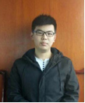

* 姚欣 / 男 / 1995 / 3年工作经验 / 15005784320  
* 求职意向 ：桌面软件开发（Qt）/ 18K 
* 入职时间 ：**2021-04-06** / 779354187@qq.com
* 本科 / 丽水学院 / 2014.07-2018.06 / 机械设计制造及其自动化
在校任班长，有良好的沟通交流能力；四年除英语外所有科目成绩保持全系第一，综测学测第一，学习能力高，有较大抗压能力；曾任所在支部党支部副书记，有一定组织能力。
* 自我评价
优点：很高的自我驱动力，时刻保持着努力上进。机械出身，热爱编程，喜欢钻研新事物。
缺点：没有驾照、英语一般、软件开发靠自学半路出家。

---

- [x] 杭州晶耐科光电技术有限公司 &emsp;/ &emsp;2018.01-2019.07 &emsp;/ &emsp;项目经理&emsp;&emsp; /&emsp; 7K
- [x] 杭州脉流科技有限公司&emsp;&emsp;&emsp;&emsp; / &emsp;2019.07-2021.03 &emsp;/ &emsp;开发组组长&emsp; /&emsp; 13k
- [ ] 杭州驰珀智能科技有限公司&emsp;&emsp; / &emsp;2021.03 - &emsp;&emsp;&emsp;&emsp;/ &emsp;软件开发&emsp; &emsp;/&emsp; 18k

# 项目经验
##### 医疗软件（传统算法）
* 软件名称：Angio、CT、OCT、IVUS、Aspect、CTP、LAO
* 软件功能：计算心血管狭窄的FFR和△P。 
* 负责工作：
&emsp;&emsp;软件模块划分和架构设计（分层+事件驱动+发布订阅）；
&emsp;&emsp;二维影像前处理的交互，包括：二维中心线提取和修正、图片运动校正、平面边缘提取和修正；
&emsp;&emsp;三维模型渲染和交互，包括模型剪裁、中心线提取、网格细化细分平滑、纹理映射、VR体渲染；
&emsp;&emsp;病例、报告、系统设置、数据安全等常用医疗软件功能的设计和开发。
##### 医疗软件（DICOM协议）
* 软件名称：AFPACS
* 软件功能：医疗影像的常用PACS服务（SCU + SCP） 
* 负责工作：
&emsp;&emsp;公司DCIOM影像传输所有业务均是自己独自调研、开发、现场测试。在公司所有产品临床中广泛使用。
##### 医疗软件（AI）
* 软件名称：DeepLV、ACCULV、AccuIVUS、AccuStroke
* 软件功能：利用AI实现心脑血管的分割提取 
* 负责工作：
&emsp;&emsp;独自完成多模块软件架构、UI实现；
&emsp;&emsp;开发二维影像和三维模型的交互、渲染、参数的计算、前处理、重构、修复、表面处理；
&emsp;&emsp;实现影像的导入、浏览、前处理、后处理；
&emsp;&emsp;libtorch调AI模型预测、预测结果的调整、CPU<=>GPU数据传输优化；
&emsp;&emsp;其中CTP的前处理、参数图计算、后处理、数字体膜验证均是自己根据论文复现。
##### AOI（Mac A面缺陷）（视觉检测软件）
* 负责工作：
&emsp;&emsp;作为项目负责人，从项目成立带领团队完成设备的外观设计、机械手控制、成像系统设计、电器控制、软件开发，到做出设备并受到客户的认可（图像算法由同事完成）。
##### AOI（汽车漆面检测系统）（视觉检测软件）
* 负责工作：
&emsp;&emsp;独自完成多相机（8-36个）、高帧率（15-30）的面阵相机实时缺陷检系统的架构和软件开发（缺陷提取、分类部分和团队其他人共同完成），系统包括一个主服务器和4台客户端。

---

# 开源项目
* KISS Dicom Viewer [https://codechina.csdn.net/a15005784320/kiss-dicom-viewer](https://codechina.csdn.net/a15005784320/kiss-dicom-viewer)
&emsp;&emsp;一个仿照RadiAnt Dicom Viewer的开源的Dicom浏览器，主要用于自己学习。
* OpenBrowser [https://codechina.csdn.net/a15005784320/openBrowser/-/tree/master/preview_V0](https://codechina.csdn.net/a15005784320/openBrowser/-/tree/master/preview_V0)
&emsp;&emsp;基于QT 一个开源的文件浏览器 目前支持.dcm .mha .mhd .stl *.ply *.vtkxml *.vtp *.vtk .bmp .jpg .pbm .pgm .png .ppm .xbm .xpm 等文件的浏览和前处理。
* Quick Event [https://codechina.csdn.net/a15005784320/Quick-Event](https://codechina.csdn.net/a15005784320/Quick-Event)
&emsp;&emsp;基于QT设计的一套控制与界面完全分离的代码模型（发布订阅模式），MVC设计思路，控制类反射与生存周期管理，对于高内聚低耦合的实践；

# 工作优势

- 了解 Windos/LInux/Mac 下软件开发，可以独立完成中小型桌面程序的架构和业务开发或根据现有架构独立开发新业务模块。
- 了解QGraphicsWidget和QWidget开发框架。
- 了解GCC、GDB、make、cmake、qt creator。
- 了解svn、git、禅道、Tapd、WIKI、蓝湖等代码管理/开发工具。
- 有ITK/VTK/OpenCV/Armadillo/DCMTK/CGAL/Halcon开发经验。
- 有shall、python、matlab开发经验。
- 有DICOM（XA、DSA、OCT、IVUS、NCCT、CTA）影像开发经验。
- 有二维和三维的交互开发以及图形处理软件开发经验。
- 有GPU应用开发经验、AI商业化开发经验。
- 有单元测试，开发、使用、维护、接口文档的编写经验。
- 有面阵/线扫相机的开发经验。
- 机械出身，plc、触摸屏、机械手、运动控制卡、伺服控制器等硬件等均有独立开发且与上位机通讯的经验。
- 个人博客  [https://beondxin.blog.csdn.net/](https://beondxin.blog.csdn.net/)

# 致谢

&emsp;&emsp;感谢您花时间阅读我的简历，期待能有机会和您共事。