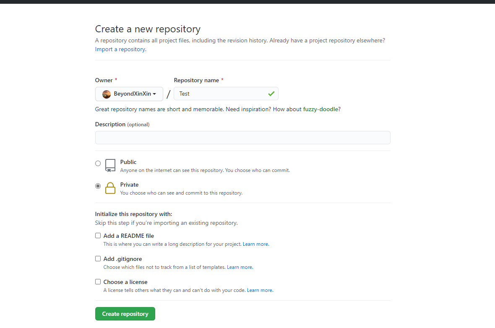
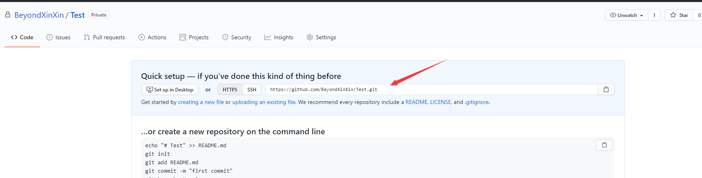
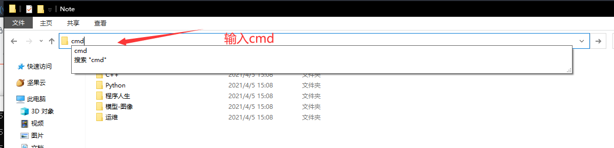
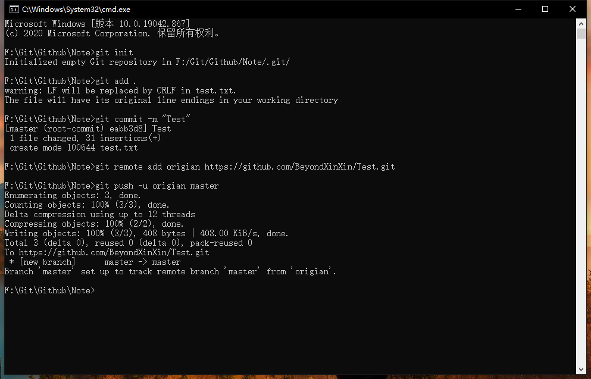
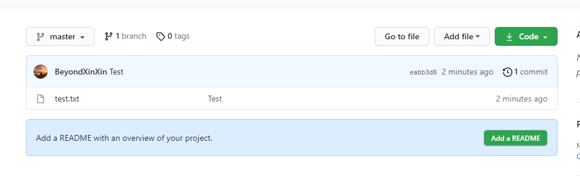

# 同步本地文件或仓库到Github

&emsp;&emsp;最近整理文件，想把一些东西存到Github的私有仓库。这里记录下方法

1. 现在Github创建好几个私有仓库，并记住地址。（我用的Https）







2. 控制台 打开本地需要同步的文件夹





3. 初始化仓库、提交文件、绑定远程地址、推送

```sh
git init
git add .
git commit -m "Test"
git remote add origian https://github.com/BeyondXinXin/Test.git
git push -u origian master
```





4. 可以再Github看到已经提交成功




